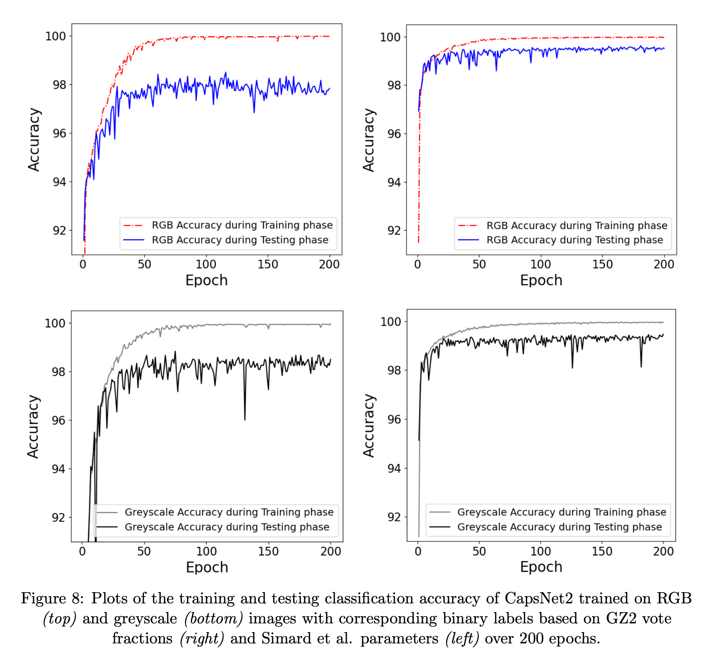
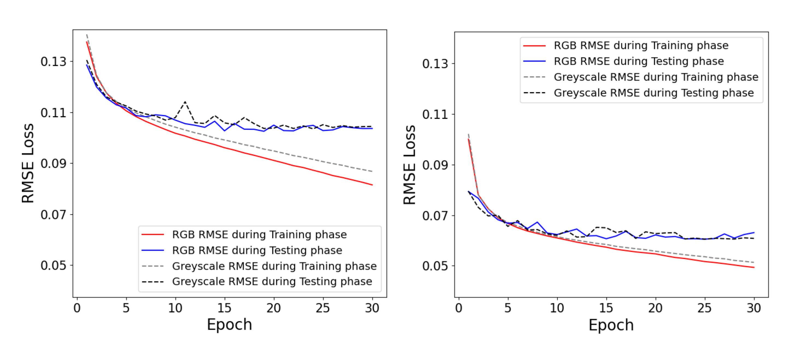

# GalaxyZoo-CapsNet

<br/>

# 📘 Overview


GalaxyZoo-CapsNet investigates the ability of a Capsule Network (CapsNet) to classify galaxy morphologies using image data from the Galaxy Zoo 2 survey.
The project aims to reproduce human classification performance and well-known physical relationships in galaxy evolution by predicting Galaxy Zoo vote fractions and structural parameters from the Simard et al. (2011) catalogue.

<br/>

# ✨ Features


- Implementation of CapsNet and ResNet for galaxy morphology prediction.
- Training and inference scripts supporting RGB and grayscale images.
- Data processing pipeline for converting raw image folders into model-ready tensors.
- Visualization tools for reconstructed images and accuracy evolution.
- Statistical comparison utilities (e.g., KS test, ROC curves, and color–mass relations).
- Supports large-scale training on GPU clusters (e.g., Lancaster University HEC).

<br/>

# 🧠 Tech Stack

```plaintex
Languages & Frameworks
	•	Python (3.8+)
	•	PyTorch
	•	Torchvision

Libraries
	•	NumPy, Pandas
	•	scikit-learn, SciPy
	•	scikit-image
	•	Matplotlib, Seaborn
	•	PIL

Hardware
	•	Optimized for GPU acceleration (CUDA).
	•	Developed on a Tesla V100 (Lancaster University HEC Cluster).


GalaxyZoo-CapsNet/
│
├── CapsNet/
│   ├── CapsNetRegressor_2.py
│   ├── CapsNetRegressor_all.py
│   ├── CapsNetPredictor_2.py
│   ├── CapsNetPredictor_all.py
│   ├── CapsNetReconstructor.py
│
├── ResNet/
│   ├── ResNetRGB.py
│   ├── ResNetGrey.py
│   ├── ResNetRGBPredict.py
│   ├── ResNetGreyPredict.py
│
├── Dataloader/
│   ├── Dataloader.py
│   ├── Segmenter_Dataloader.py
│
├── DataAnalysis/
│   ├── AccuracyPlot.py
│   ├── ColourBar_Plot.py
│   ├── Colour_Mass_Plot.py
│   ├── HistogramPlot.py
│   ├── KS_Test.py
│   ├── ROC_BinaryLabel.py
│   ├── ROC_Plotter.py
│   ├── ReconstructImages.py
│   ├── SersicVotes_Errors.py
│
├── results/
│   ├── acc.png
│
└── README.md
```

<br/>

# ⚙️ Installation

```bash
# Clone the repository and install dependencies:

git clone https://github.com/Commit2Cosmos/DeepCaps_Pytorch.git
cd DeepCaps_Pytorch
pip install -r requirements.txt

# If using a GPU, ensure PyTorch is installed with CUDA support.
# You can verify this by running:

python -c "import torch; print(torch.cuda.is_available())"
```
<br/>

# 🚀 Usage

### 1. Prepare Data


Place all galaxy images in a directory and prepare a CSV file where:
- The first column contains relative image paths.
- The remaining columns contain Galaxy Zoo vote fractions or structural parameters.


```bash
#Run the dataloader:

python Dataloader/Dataloader.py --root_dir ./images --csv_file ./data/labels.csv

```

### 2. Train the Model


```bash
# Example (CapsNet Regressor):
python CapsNet/CapsNetRegressor_2.py
```

### 3. Evaluate and Predict

```bash
# To predict using pretrained weights:
python CapsNet/CapsNetPredictor_2.py --weights epoch_50.pt

# Accuracy over epochs
python DataAnalysis/AccuracyPlot.py
# ROC curve
python DataAnalysis/ROC_Plotter.py
# Image reconstructions
python DataAnalysis/ReconstructImages.py
```
<br/>

# 📊 Results

<div style="background-color: white; padding: 5px; margin: 25px 0px">
    
</div>
<div style="background-color: white; padding: 5px; margin: 25px 0px">
    
</div>

<br/>


# 🧬 Using Your Own Dataset


1. Organize images in a single directory (e.g., ./data/custom_images).
2. Prepare a CSV file with:
	- Column 1: image filenames.
	- Columns 2–N: target vote fractions or labels.
3. Adjust input channels in scripts:
```
	in_channels = 3  # for RGB
	in_channels = 1  # for grayscale
```

<br/>

# 📚 References

1. [Galaxy Zoo](https://data.galaxyzoo.org)
2. [Simard et al. (2011)](https://ui.adsabs.harvard.edu/abs/2011ApJS..196…11S/abstract)
3. [CapsNet Base Model: Reza Katebi et al., Galaxy Morphology Classification with Capsule Networks](https://doi.org/10.1093/mnras/stz915)